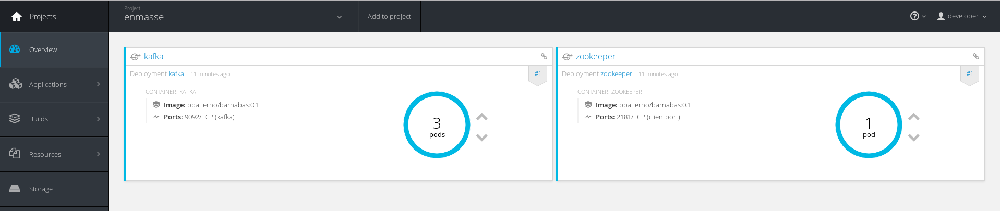

# Bridging AMQP - Kafka (demo)

This demo shows how it's possible to use the [AMQP](http://www.amqp.org/) protocol for sending/receiving messages to/from [Apache Kafka](https://kafka.apache.org/) cluster.
It's based on using an [EnMasse](https://github.com/EnMasseProject) deployment which is a Maas (Messaging as a Service) platform running on OpenShift. This platform provides
the messaging infrastructure for connecting using different protocols like AMQP and MQTT and this specific demo also uses the [AMQP-Kafka bridge](https://github.com/EnMasseProject/amqp-kafka-bridge)
component in order to have a "gate" for accessing Apache Kafka topics through AMQP semantics. The Apache Kafka cluster is deployed using the [barnabas](https://github.com/EnMasseProject/barnabas)
project available under the same EnMasse umbrella.

More information about single deployed components are available at related projects repositories.

## Prerequisites

For this demo, you need the OpenShift client tools and for that you can download the [OpenShift Origin](https://github.com/openshift/origin/releases) ones.
Follow [this guide](https://github.com/openshift/origin/blob/master/docs/cluster_up_down.md) for setting up a local developer instance of OpenShift, for having an
accessible registry for Docker and starting the cluster locally.

## One "script" deployment

In order to deploy this demo on OpenShift, a bunch of steps are needed as explained in the next chapter. If you want to avoid to do them, a "one click" deployment
script is available in the repository.
After having the OpenShift cluster up and running and the client tools in the PATH, the deployment can be executed launching the following bash script
(from the "scripts" directory)

    bash openshift_deploy.sh

When you want to shutdown the demo instance, there is the following useful script :

    bash openshift_undeploy.sh

## Step by Step deployment

### Creating project

First, create a new project :

    oc new-project enmasse

### Deploying the Apache Kafka cluster

The Apache Kafka cluster deployment uses persistent volumes for storing Zookeeper and Kafka brokers data (i.e. logs, consumer offsets, ...).
For a local development, we can just use local drive for that but creating directory with read/write access permissions is needed.

    mkdir /tmp/zookeeper
    chmod 777 /tmp/zookeeper
    mkdir /tmp/kafka
    chmod 777 /tmp/kafka

In this way we have two different directories that will be used as persistent volumes by the OpenShift resources YAML files.

After making available above accessible directories, the persistent volumes need to be deployed by OpenShift administrator. In this case you can just login
as system admin on your local OpenShift cluster for doing that.

    oc login -u system:admin

The persistent volumes can be deployed in the following way :

    oc create -f https://raw.githubusercontent.com/EnMasseProject/barnabas/master/kafka-persisted/resources/zookeeper-volume.yaml
    oc create -f https://raw.githubusercontent.com/EnMasseProject/barnabas/master/kafka-persisted/resources/kafka-volume.yaml

After that you can return to be a "developer" user.

    oc login -u developer

In order to complete the persistent volumes actions, the claims need to be deployed.

    oc create -f https://raw.githubusercontent.com/EnMasseProject/barnabas/master/kafka-persisted/resources/zookeeper-volume-claim.yaml
    oc create -f https://raw.githubusercontent.com/EnMasseProject/barnabas/master/kafka-persisted/resources/kafka-volume-claim.yaml

After that, the Zookeeper service and deployment can be create.

    oc create -f https://raw.githubusercontent.com/EnMasseProject/barnabas/master/kafka-persisted/resources/zookeeper-service.yaml
    oc create -f https://raw.githubusercontent.com/EnMasseProject/barnabas/master/kafka-persisted/resources/zookeeper.yaml

Finally, the Kafka service and brokers deployment.

    oc create -f https://raw.githubusercontent.com/EnMasseProject/barnabas/master/kafka-persisted/resources/kafka-service.yaml
    oc create -f https://raw.githubusercontent.com/EnMasseProject/barnabas/master/kafka-persisted/resources/kafka.yaml

Accessing the OpenShift console, the current deployment should be visible.

### Deploying EnMasse with Kafka support

For deploying the EnMasse platform you can follow the instruction [here](https://github.com/EnMasseProject/openshift-configuration) but the main steps
are described here for simplicity.

Some permissions need to be granted before setting up the messaging service.

The permissions can be setup with the following commands:

    oc create sa enmasse-service-account -n $(oc project -q)
    oc policy add-role-to-user view system:serviceaccount:$(oc project -q):default
    oc policy add-role-to-user edit system:serviceaccount:$(oc project -q):enmasse-service-account

EnMasse is provided with different templates which are able to provision the components with/without SSL/TLS support for example or with/without Kafka support.
For this demo, the template with Kafka support is needed and the entire EnMasse infrastracture can be deployed in the following way :

    oc process -f https://raw.githubusercontent.com/EnMasseProject/openshift-configuration/master/generated/enmasse-template-with-kafka.yaml | oc create -f -

The final deployment is visible using the OpenShift console.

There are a bunch of components related to the messaging layer (for connecting through AMQP protocol), the administration, the MQTT protocol gateway and finally
the AMQP - Kafka bridge.

### Deploying the Kafka consumer Web UI

The current demo project provide a simple application which starts a Kafka consumer inside the cluster in order to get messages from the Kafka cluster and showing them
into a web page. This application needs to be build for the source code but even for the Docker image that will be deployed under the EnMasse infrastructure.
From the _kafka-consumer-webui_, execute the folliwng command for building the application :

    mvn package -Pbuild-docker-image

After the build, an _enmasseproject/kafka-consumer-webui_ image is available in the local Docker registry and the OpenShift resources files in the target directory.

This application can be configured in terms of consumer group and topic to read from; this configuration is provided through a ConfigMap that need to be deployed in the
OpenShift cluster before deploying the entire application.

    oc create -f /<path-to-github-repo>/amqp-kafka-demo/kafka-consumer-webui/target/fabric8/kafka-consumer-webui-configmap.yml

You can modify the default parameters (i.e. groupid = mygroup, topic = kafka.mytopic, auto.offset.reset = earliest) before deploying the above ConfigMap.

Finally, for deploying the application :

    oc create -f /<path-to-github-repo>/amqp-kafka-demo/kafka-consumer-webui/target/fabric8/kafka-consumer-webui-svc.yml
    oc create -f /<path-to-github-repo>/amqp-kafka-demo/kafka-consumer-webui/target/fabric8/kafka-consumer-webui-deployment.yml
    oc create -f /<path-to-github-repo>/amqp-kafka-demo/kafka-consumer-webui/target/fabric8/kafka-consumer-webui-route.yml

The Kafka Web UI application is now running in EnMasse with a route that can be used to access the related web page

## Running Vert.x Proton sender

The current repo provides a simple [Vert.x Proton](https://github.com/vert-x3/vertx-proton) based application for sending messages on a Kafka topic using the AMQP protocol so that we are able to see them
in the web page. The application is provided through tht _vertx-proton-examples_ project that needs to be build and packaged using Maven.
After that, we can use it for sending messages :

    java -cp ./target/vertx-proton-examples-1.0-SNAPSHOT.jar enmasse.amqp.Sender -a 172.30.63.201 -t kafka.mytopic

The provided address is the messaging service address inside the OpenShift cluster; other options are available for specifying the port and the number of messages to send.

The messages are sent to the Kafka topic and received by the consumer application showing them in the web page.

## Running Qpid JMS sender

Other then a pure AMQP client example (using Vert.x Proton), the repo provides a sender example using the [Qpid JMS client](https://qpid.apache.org/components/jms/).
It shows how it's possible to interact with Apache Kafka even with JMS API, of course using AMQP as underlying protocol like the Qpid project.
The application is provided through tht _qpid-jms-examples_ project that needs to be build and packaged using Maven.

After that, we can use it for sending messages :

    java -cp ./target/qpid-jms-examples-1.0-SNAPSHOT.jar enmasse.jms.Sender -a 172.30.63.201 -t kafka.mytopic

