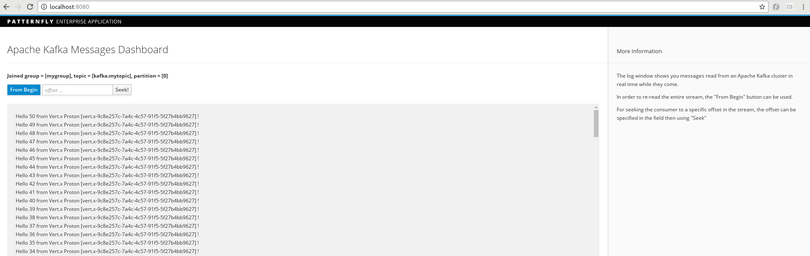

# Bridging AMQP - Kafka (demo)

This demo shows how it's possible to use the [AMQP](http://www.amqp.org/) protocol for sending/receiving messages to/from [Apache Kafka](https://kafka.apache.org/) cluster.
It's based on using an [EnMasse](https://github.com/EnMasseProject) deployment which is a Maas (Messaging as a Service) platform running on OpenShift. This platform provides
the messaging infrastructure for connecting using different protocols like AMQP and MQTT and this specific demo also uses the [AMQP-Kafka bridge](https://github.com/EnMasseProject/amqp-kafka-bridge)
component in order to have a "gate" for accessing Apache Kafka topics through AMQP semantics. The Apache Kafka cluster is deployed using the [barnabas](https://github.com/EnMasseProject/barnabas)
project available under the same EnMasse umbrella.

More information about single deployed components are available at related projects repositories.

## Prerequisites

For this demo, you need the OpenShift client tools and for that you can download the [OpenShift Origin](https://github.com/openshift/origin/releases) ones.
Follow [this guide](https://github.com/openshift/origin/blob/master/docs/cluster_up_down.md) for setting up a local developer instance of OpenShift, for having an
accessible registry for Docker and starting the cluster locally.

## One "script" deployment

In order to deploy this demo on OpenShift, a bunch of steps are needed as explained in the next chapter. If you want to avoid to do them, a "one click" deployment
script is available in the repository.
After having the OpenShift cluster up and running and the client tools in the PATH, the deployment can be executed launching the following bash script
(from the "scripts" directory)

    bash openshift_deploy.sh

When you want to shutdown the demo instance, there is the following useful script :

    bash openshift_undeploy.sh

> it's also possible to use the TLS enabled EnMasse deployment in order to connect AMQP clients outside of the cluster through an OpenShift route. 
In this case the _openshift_tls_deploy.sh_ should be used.

## Step by Step deployment

### Creating project

First, create a new project :

    oc new-project enmasse

### Deploying the Apache Kafka cluster

The Apache Kafka cluster deployment is based on Stateful Sets and, for demo purpose, it's just made of one Zookeeper instance and three Apache Kafka replicas.
Furthermore, it uses persistent volumes for storing Zookeeper and Kafka brokers data (i.e. logs, consumer offsets, ...).
For a local development, we can just use local drive for that but creating directory with read/write access permissions is needed.

    mkdir /tmp/kafka-a
    chmod 777 /tmp/kafka-a
    mkdir /tmp/kafka-b
    chmod 777 /tmp/kafka-b
    mkdir /tmp/kafka-c
    chmod 777 /tmp/kafka-c
    mkdir /tmp/kafka-d
    chmod 777 /tmp/kafka-d

In this way we have two different directories that will be used as persistent volumes by the OpenShift resources YAML files.

After making available above accessible directories, the persistent volumes need to be deployed by OpenShift administrator. In this case you can just login
as system admin on your local OpenShift cluster for doing that.

    oc login -u system:admin

The persistent volumes can be deployed in the following way :

    oc create -f https://raw.githubusercontent.com/EnMasseProject/barnabas/master/kafka-statefulsets/resources/cluster-volumes.yaml

After that you can return to be a "developer" user.

    oc login -u developer

Then, the Zookeeper services and stateful sets can be created.

    oc create -f https://raw.githubusercontent.com/EnMasseProject/barnabas/master/kafka-statefulsets/resources/zookeeper-headless-service.yaml
    oc create -f https://raw.githubusercontent.com/EnMasseProject/barnabas/master/kafka-statefulsets/resources/zookeeper-service.yaml
    oc create -f https://raw.githubusercontent.com/EnMasseProject/barnabas/master/kafka-statefulsets/resources/zookeeper.yaml

Finally, the Kafka services and broker stateful sets.

    oc create -f https://raw.githubusercontent.com/EnMasseProject/barnabas/master/kafka-statefulsets/resources/kafka-headless-service.yaml
    oc create -f https://raw.githubusercontent.com/EnMasseProject/barnabas/master/kafka-statefulsets/resources/kafka-service.yaml
    oc create -f https://raw.githubusercontent.com/EnMasseProject/barnabas/master/kafka-statefulsets/resources/kafka.yaml

Accessing the OpenShift console, the current deployment should be visible.

### Deploying EnMasse with Kafka support

For deploying the EnMasse platform you can follow the instruction [here](https://github.com/EnMasseProject/openshift-configuration) but the main steps
are described here for simplicity.

Some permissions need to be granted before setting up the messaging service.

The permissions can be setup with the following commands:

    oc create sa enmasse-service-account -n $(oc project -q)
    oc policy add-role-to-user view system:serviceaccount:$(oc project -q):default
    oc policy add-role-to-user edit system:serviceaccount:$(oc project -q):enmasse-service-account

EnMasse is provided with different templates which are able to provision the components with/without SSL/TLS support for example or with/without Kafka support.
For this demo, the template with Kafka support is needed and the entire EnMasse infrastracture can be deployed in the following way :

    oc process -f https://raw.githubusercontent.com/EnMasseProject/enmasse/master/generated/enmasse-template-with-kafka.yaml | oc create -f -

The final deployment is visible using the OpenShift console.

There are a bunch of components related to the messaging layer (for connecting through AMQP protocol), the administration, the MQTT protocol gateway and finally
the AMQP - Kafka bridge.

### Deploying the Kafka consumer Web UI

The current demo project provide a simple application which starts a Kafka consumer inside the cluster in order to get messages from the Kafka cluster and showing them
into a web page. This application needs to be build for the source code but even for the Docker image that will be deployed under the EnMasse infrastructure.
From the _kafka-consumer-webui_, execute the folliwng command for building the application :

    mvn package -Pbuild-docker-image

After the build, an _enmasseproject/kafka-consumer-webui_ image is available in the local Docker registry and the OpenShift resources files in the target directory.

This application can be configured in terms of consumer group and topic to read from; this configuration is provided through a ConfigMap that need to be deployed in the
OpenShift cluster before deploying the entire application.

    oc create -f /<path-to-github-repo>/amqp-kafka-demo/kafka-consumer-webui/target/fabric8/kafka-consumer-webui-configmap.yml

You can modify the default parameters (i.e. groupid = mygroup, topic = kafka.mytopic, auto.offset.reset = earliest) before deploying the above ConfigMap.

Finally, for deploying the application :

    oc create -f /<path-to-github-repo>/amqp-kafka-demo/kafka-consumer-webui/target/fabric8/kafka-consumer-webui-svc.yml
    oc create -f /<path-to-github-repo>/amqp-kafka-demo/kafka-consumer-webui/target/fabric8/kafka-consumer-webui-deployment.yml
    oc create -f /<path-to-github-repo>/amqp-kafka-demo/kafka-consumer-webui/target/fabric8/kafka-consumer-webui-route.yml

The Kafka Web UI application is now running in EnMasse with a route that can be used to access the related web page.

In this web page :

* status of the internal Kafka consumer (if it's joining or already joined the consumer group)
* dashboard which shows messages received in real time (or re-reading the stream)
* button for re-reading the stream from the beginning
* input and button for re-reading the stream starting from a specified offset

## AMQP Vert.x Proton

The current repo provides simple [Vert.x Proton](https://github.com/vert-x3/vertx-proton) based applications for sending/receiving messages to/from a generic address, 
through AMQP protocol, that can be, for example, a queue or a topic on a broker. Thanks to the way how the AMQP - Kafka bridge works, it can be used specifying 
a Kafka topic as AMQP address. The application is provided through the _vertx-proton-examples_ project that needs to be build and packaged using Maven.

### Sending messages

After building it, we can use the application for sending messages in the following way :

    java -jar ./target/vertx-sender.jar -h 172.30.63.201 -a kafka.mytopic

The provided address is the messaging service address inside the OpenShift cluster; other options are available for specifying the port, the number of messages to send and
the delay between each other.

The messages are sent to the Kafka topic and received by the consumer application showing them in the web page.

### Receiving messages

In the same way, we can receive messages :

    java -jar ./target/vertx-receiver.jar enmasse.amqp.Receiver -h 172.30.63.201 -a kafka.mytopic/group.id/mygroup

Another available option is specifying a filter on messages to receive (i.e. "count % 2 = 0"). Of course, it works against a broker and not Apache Kafka.

## Qpid JMS

Other then pure AMQP client examples (using Vert.x Proton), the repo provides a sender/receiver example using te [Qpid JMS client](https://qpid.apache.org/components/jms/).
It shows how it's possible to interact with Apache Kafka even with JMS API, of course using AMQP as underlying protocol like the Qpid project.
This application is quite generic, because it allows to specify a JMS queue or topic as destination that can even be a Kafka topic.

The application is provided through the _qpid-jms-examples_ project that needs to be build and packaged using Maven.

### Sending messages

After building it, we can use the application for sending messages in the following way :

    java -jar ./target/jms-sender.jar -h 172.30.63.201 -t kafka.mytopic
    
The provided address is the messaging service address inside the OpenShift cluster; other options are available for specifying the port, the number of messages to send and
the delay between each other. For sending messages to a queue, the _-q_ option should be used instead of the previous _-t_.

The messages are sent to the Kafka topic and received by the consumer application showing them in the web page.

### Receiving messages

In the same way, we can receive messages :

    java -jar ./target/jms-receiver.jar -h 172.30.63.201 -t kafka.mytopic/group.id/mygroup

Another available option is specifying a filter on messages to receive (i.e. "count % 2 = 0"). Of course, it works against a broker and not Apache Kafka.
Even in this case, for receiving messages from a queue, the _-q_ option should be used instead of the previous _-t_.

## Using MQTT protocol

Thanks to an MQTT gateway, the EnMasse project supports the MQTT protocol and all its related features; the same features (i.e. last will testament, ...) are available on
AMQP as well. Related to this demo, it means that using an MQTT client, it's possible to publish messages to an Apache Kafka topic. 

> The MQTT gateway is accessible to a different address from the AMQP one

Using the simple `mosquitto_pub` application, it's possible to have an MQTT to Apache Kafka flow in the following way :

    mosquitto_pub -h 172.30.192.59 -t kafka.mytopic -q 1 -m "Hello from MQTT"
    
## Request/Reply

One of the pattern that is difficult to support using Apache Kafka is the well know _request/reply_ where a client (requestor) sends a request message to a server (responder)
which processes this request and sends a response back to the client.
This demo repository provides a couple of examples of implementing this pattern both with JMS and Vert.x Proton (using raw AMQP) but in two different ways :

* the Vert.x Proton implementation goes through the router with direct messaging. The server opens a connection to the router and attaches a link on a "request" address
for receiving request messages from the client. The client opens a connection to the router attaching two links : the first one on the "request" address for sending
the request message to the server and another "dynamic" one for receiving the response from the server. It's up to the router to create a dynamic (temporary) address.
* the JMS implementation uses a couple of queues on a broker. A queue is used by the client for sending the request message to the server and a temporary queue used by the client
for receiving the response from the server

### AMQP Vert.x Proton

Because this example uses direct messaging through the router, it's needed to configure the "request" address on the router itself.
In order to do that, without modifying the static router configuration file (restarting the router), it's possible to use the _qdmanage_ tool in the following way :

    qdmanage -b 172.30.176.73 create type=address name=request prefix=request distribution=balanced
    
Where the provided address is the messaging service address inside the OpenShift cluster.

For starting the client side :

    java -cp ./target/vertx-proton-examples-1.0-SNAPSHOT.jar enmasse.amqp.Client -h 172.30.63.201 -p 5672

The provided address and port are the messaging service ones inside the OpenShift cluster.
For starting the server side :

    java -cp ./target/vertx-proton-examples-1.0-SNAPSHOT.jar enmasse.amqp.Client -h 172.30.63.201 -p 55673

The provided address and port are the messaging service address and the internal port for connected services inside the OpenShift cluster.

### Qpid JMS

For starting the client side :

    java -cp ./target/qpid-jms-examples-1.0-SNAPSHOT.jar enmasse.jms.Client -h 172.30.63.201 -p 5672

For starting the server side :

    java -cp ./target/qpid-jms-examples-1.0-SNAPSHOT.jar enmasse.jms.Server -h 172.30.63.201 -p 5672
    
The provided address and port are the messaging service ones inside the OpenShift cluster.
    

